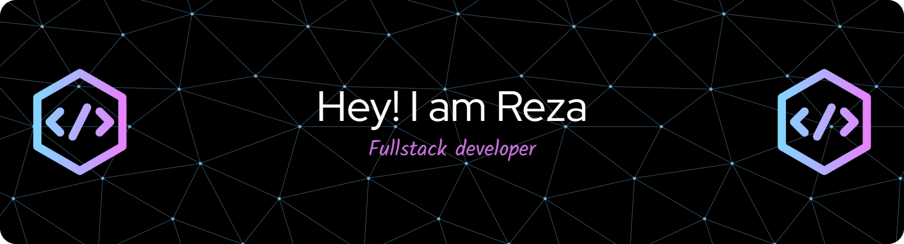

# Mohammad9473
 
 

  

## 👋 About Me  

I’m a **Full Stack Developer** with **5+ years of experience** building and maintaining scalable **web** and **mobile applications**.  

🚀 My expertise spans **frontend, backend, DevOps, and machine learning** — I enjoy turning complex requirements into production-ready solutions.  

💻 I’ve worked across **e-commerce, health tech, and SaaS**, delivering high-quality applications at both **startups** and **enterprise scale**.  

🌐 Always open to new opportunities and collaborations in the tech space.

## 🛠️ Tech Stack  

  

## 📊 GitHub Stats  

  
  

  

## 🤝 Connect With Me  

  
  

